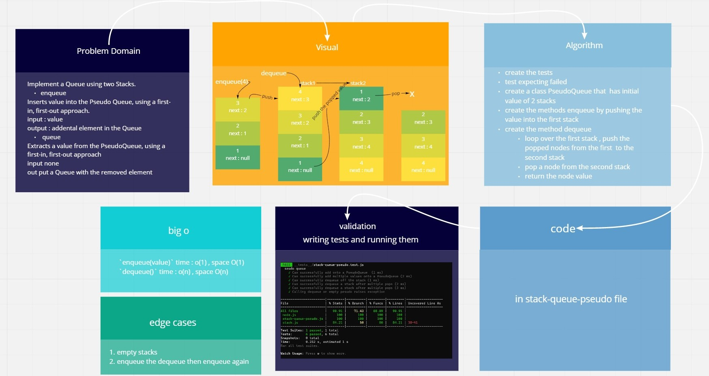

# Stacks And Queues

[**Pull Request**](https://github.com/hibasalem/data-structures-and-algorithms/pull/44)

Implementation of stacks and queues using linked lists

## Challenge

creating classes for each of the LinkedList and the node including methods for searching, inserting and turning it to string on the list then perform unit tests on each class

## Approach & Efficiency

- code chalange 10

  - stack

    `push(value)` time : o(1) , space O(1)  
    `pop()` time : o(1) , space O(1)  
    `peek()` time : o(1) , space O(1)  
    `isEmpty()` time : o(1) , space O(1)

  - queue

    `enqueue(value)` time : o(n) , space O(1)  
    `dequeue()` time : o(1) , space O(1)  
    `peek()` time : o(1) , space O(1)  
    `isEmpty()` time : o(1) , space O(1)

- code chalange 11

  - stack-queue-pesudo

    `enqueue(value)` time : o(1) , space O(1)  
    `dequeue()` time : o(n) , space O(n)

---

---

- code chalange 10

  - **_stack_**

    **push(value)** : adds a new node with that value to the top of the stack with an O(1) Time performance.  
    **pop()** : Removes the node from the top of the stack  
    **peek()** : Returns the Value of the node located at the top of the stack  
    **isEmpty()** : Returns a boolean indicating whether or not the stack is empty.

  - **_queue_**

    **enqueue(value)** : adds a new node with that value to the back of the queue with an O(1) Time performance.  
    **dequeue()** : Removes the node from the front of the queue  
    **peek()** : Returns the Value of the node located at the front of the queue  
    **isEmpty()** : Returns a boolean indicating whether or not the queue is empty

- code chalange 11

  - **_PseudoQueue_**

  **enqueue(value)** : Inserts value into the PseudoQueue, using a first-in, first-out approach.

  **dequeue()** : Removes the node from the back of the PseudoQueue
