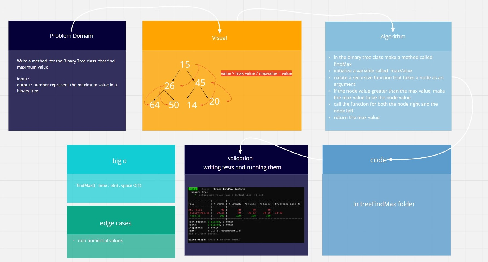

# Stacks And Queues

[**Pull Request**](https://github.com/hibasalem/data-structures-and-algorithms/pull/46)

Implementation of trees

## Challenge

Create a Binary Tree class and a Binary Search Tree class

## Approach & Efficiency

code chalange 15

- BinaryTree

  `preOrder()` time : O(log n) , space O(n)  
  `inOrder()` time : O(log n) , space O(n)  
  `postOrder()` time : O(log n) , space O(n)

- BinarySearchTree

  `contains(value)` : time : O(n) , space O(n)  
  `add(value)` : time O(n), spaceO(n)

code chalange 16

- BinaryTree

  `findmax()` time : O(log n) , space O(1)

---

---

code chalange 15

- **_BinaryTree_**

  - **preOrder()** : returns an array of the values, ordered appropriately.

  - **inOrder()** : returns an array of the values, ordered appropriately.

  - **postOrdre()** : returns an array of the values, ordered appropriately.

- **_BinarySearchTree_**

  - **contains(value)** : Returns a boolean indicating whether or not the value is in the tree at least once.

  - **add(value)** :Adds a new node with that value in the correct location in the binary search tree.

code chalange 16

- BinaryTree

  - **findMax()** : returns the max value in a tree
