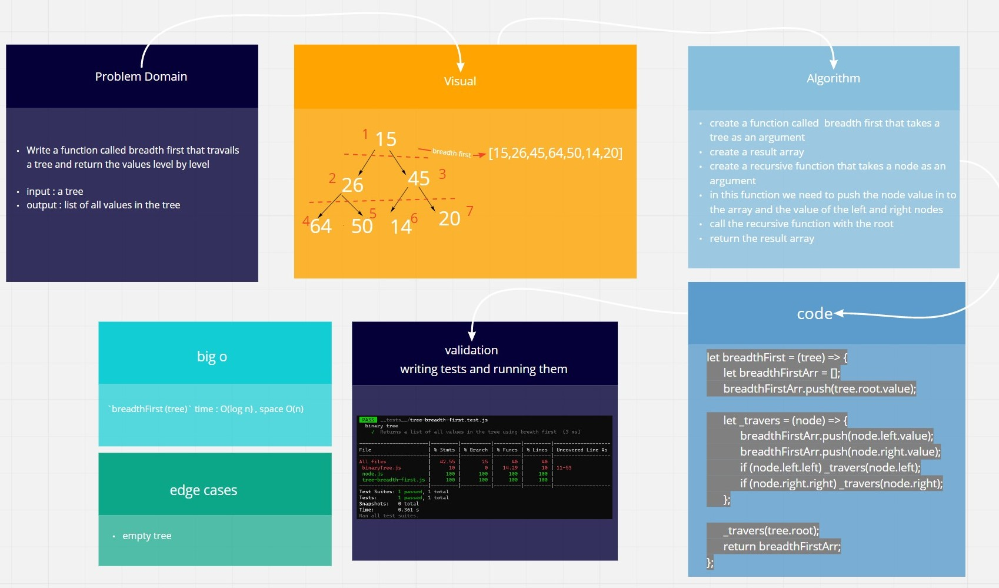

# trees

[**Pull Request**](https://github.com/hibasalem/data-structures-and-algorithms/pull/47)
[**code folder**](https://github.com/hibasalem/data-structures-and-algorithms/tree/main/javascript/17-tree-breadth-first)

Implementation of trees

## Challenge

Create a Binary Tree class and a Binary Search Tree class

## Approach & Efficiency

---

code chalange 15

- BinaryTree

  **_`preOrder()`_** time : O(log n) , space O(n)  
  **_`inOrder()`_** time : O(log n) , space O(n)  
  **_`postOrder()`_** time : O(log n) , space O(n)

- BinarySearchTree

  **_`contains(value)`_** : time : O(n) , space O(n)  
  **_`add(value)`_** : time O(n), spaceO(n)

code chalange 16

- BinaryTree

  **_`findmax()`_** time : O(log n) , space O(1)

code chalange 17

- BinaryTree

  **_`breadthFirst(tree)`_** time : O(log n) , space O(n)

---

code chalange 15

- **_BinaryTree_**

  - **`preOrder()`** : returns an array of the values, ordered appropriately.

  - **`inOrder()`** : returns an array of the values, ordered appropriately.

  - **`postOrdre()`** : returns an array of the values, ordered appropriately.

- **_BinarySearchTree_**

  - **`contains(value)`** : Returns a boolean indicating whether or not the value is in the tree at least once.

  - **`add(value)`** :Adds a new node with that value in the correct location in the binary search tree.

code chalange 16

- BinaryTree

  - **`findMax()`** : returns the max value in a tree

code chalange 17

- BinaryTree

  - **`breadthFirst(tree)`** : returns a list of all values in the tree level by level
