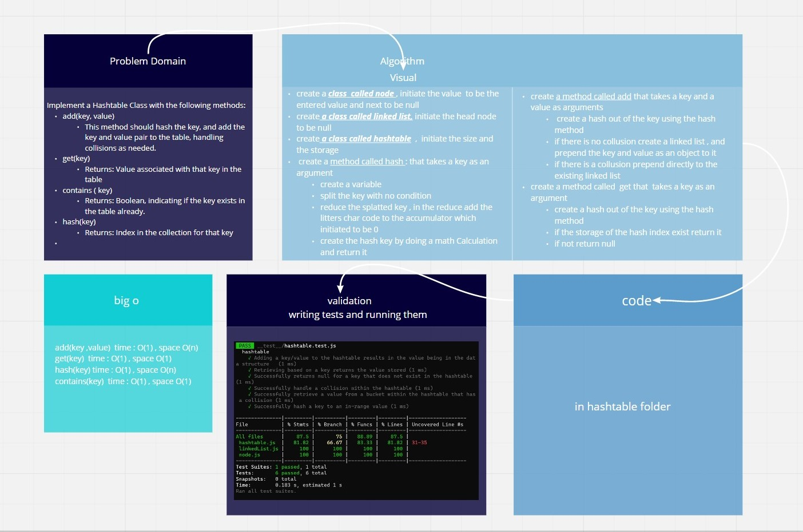

# Hash Tables

Implementation of Hash Tables

[**Pull Request**](https://github.com/hibasalem/data-structures-and-algorithms/pull/49)  
[**code folder**](30-hashtable)

## Challenge

Implement a Hashtable Class with the following methods : (add , hash , get and contains )

## Approach & Efficiency

---

- Hashtable

  **_`add(key ,value)`_** time : O(1) , space O(n)  
  **_`get(key)`_** time : O(1) , space O(1)  
  **_`hash(key)`_** time : O(1) , space O(n)
  **_`contains(key)`_** time : O(1) , space O(1)

---

## API

- Hashtable

  - **_`add(key ,value)`_** : This method hash the key, and add the key and value pair to the table
  - **_`get(key)`_** : Returns the Value associated with that key in the table
  - **_`hash(key)`_** : Returns an index in the collection for that key
  - **_`contains(key)`_** : Returns a boolean, indicating if the key exists in the table already
