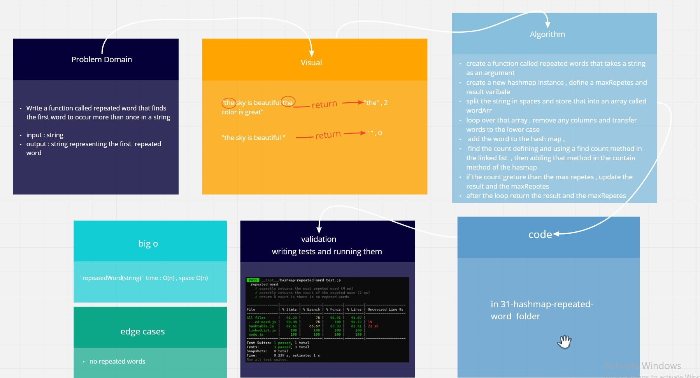

# Hash Tables

Implementation of Hash Tables

[**Pull Request**](https://github.com/hibasalem/data-structures-and-algorithms/pull/50)  
[**code folder**]()

## Challenge

Find the most repeated word in a book.

## Approach & Efficiency

---

- Hashtable

  - **_`repeatedWord(string)`_** time : O(n) , space O(n)

---

## API

- Hashtable

  - **_`repeatedWord(string)`_** : This method Finds the most repeated word in a book.
