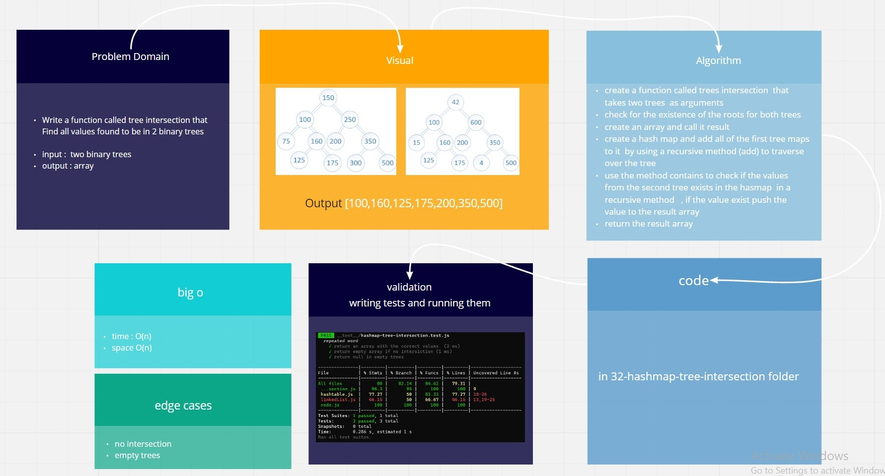

# Hash Tables

Implementation of Hash Tables

[**Pull Request**](https://github.com/hibasalem/data-structures-and-algorithms/pull/51)  
[**code folder**](https://github.com/hibasalem/data-structures-and-algorithms/tree/main/javascript/32-hashmap-tree-intersection)

## Challenge

Find all values found to be in 2 binary trees

## Approach & Efficiency

---

- Hashtable

  - **_`treeIntersection(tree1 , tree2)`_** time : O(n) , space O(n)

---

## API

- Hashtable

  - **_`treeIntersection(tree1 , tree2)`_** : This method finds all values found to be in 2 binary trees

