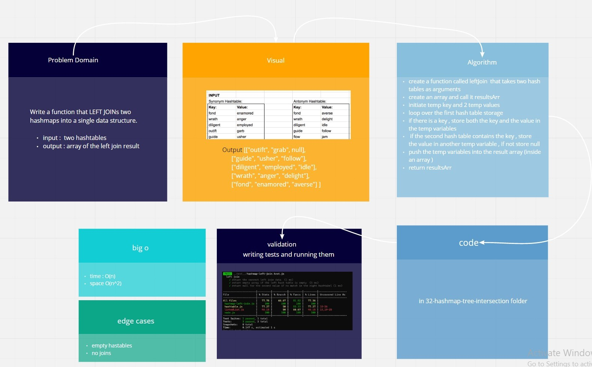

# Hash Tables

Implementation of Hash Tables

[**Pull Request**](https://github.com/hibasalem/data-structures-and-algorithms/pull/52)  
[**code folder**](https://github.com/hibasalem/data-structures-and-algorithms/tree/main/javascript/33-hashmap-left-join)

## Challenge

Write a function that LEFT JOINs two hashmaps into a single data structure.

## Approach & Efficiency

---

- Hashtable

  - **_`leftJoin(hash1, hash2)`_** time : O(n) , space O(n)

---

## API

- Hashtable

  - **_`leftJoin(hash1, hash2)`_** : This method LEFT JOINs two hashmaps into a single data structure.
