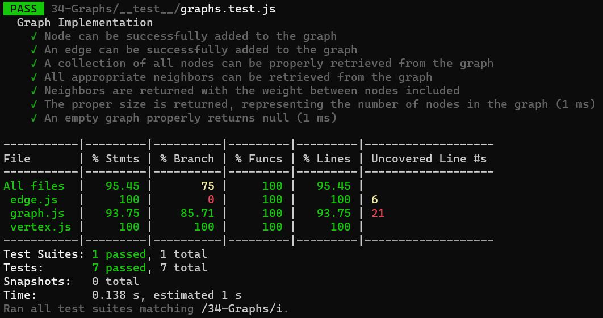

# graphs

Implementation of Hash Tables

[**Pull Request 2**](https://github.com/hibasalem/data-structures-and-algorithms/pull/54)  
[**Pull Request**](https://github.com/hibasalem/data-structures-and-algorithms/pull/53) 

[**code folder**](https://github.com/hibasalem/data-structures-and-algorithms/tree/main/javascript/34-Graphs)

## Challenge

Implement your own Graph. The graph should be represented as an adjacency list

## Approach & Efficiency

- Graph

  - **_`addNode(vertex)`_** time : O(n) , space O(n)
  - **_`addEdge(startVertex, endVertex, weight)`_** time : O(n) , space O(n)
  - **_`getnodes()`_** time : O(n) , space O(n)
  - **_`getNeighbors(vertex)`_** time : O(n) , space O(n)
  - **_`size() `_** time : O(n) , space O(n)

---

## API

- Graph

  - **_`addNode(vertex)`_** : This method add a vetrex to a graph
  - **_`addEdge(startVertex, endVertex, weight)`_** : Adds a new edge between two nodes in the graph
  - **_`getnodes()`_** : This method Returns all of the nodes in the graph as a collection
  - **_`getNeighbors(vertex)`_** : This method Returns a collection of edges connected to the given node
  - **_`size() `_** : This method Returns the total number of nodes in the graph

