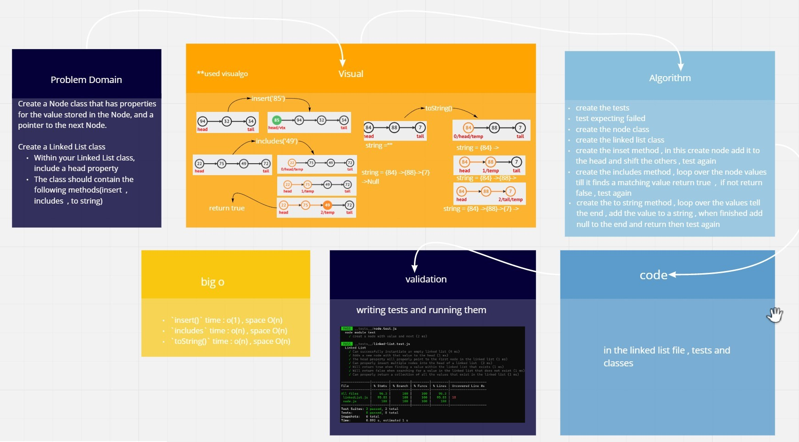

# Singly Linked List

[**Pull Request**](https://github.com/hibasalem/data-structures-and-algorithms/pull/30)

Implementation of the linked lists

## Challenge

creating classes for each of the LinkedList and the node including methods for searching, inserting and turning it to string on the list then perform unit tests on each class

## Approach & Efficiency

<!-- What approach did you take? Why? What is the Big O space/time for this approach? -->

`insert()` time : o(1) , space O(n)  
`includes()` time : o(n) , space O(n)  
`toString()` time : o(n) , space O(n)

## API

- **insert** : adds to the head of the link list
- **includes** : serches for a value in the linked list
- **insert** : return the valuse in the liked list on a string
