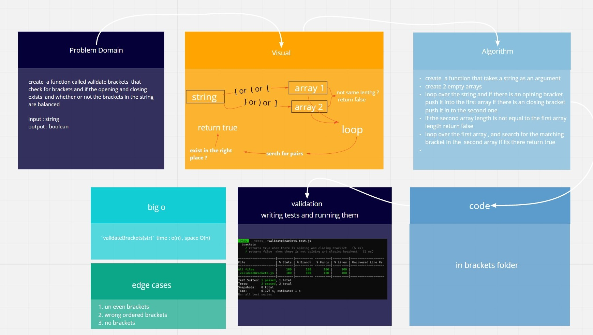

# Stacks And Queues

[**Pull Request**](https://github.com/hibasalem/data-structures-and-algorithms/pull/45)

## Challenge

Write a function called validate brackets check whether or not the brackets in the string are balanced

## Approach & Efficiency

`validateBrackets(str)` time : o(n) , space O(n)

---

---

**_`validateBrackets(str)`_** : check whether or not the brackets in the string are balanced
