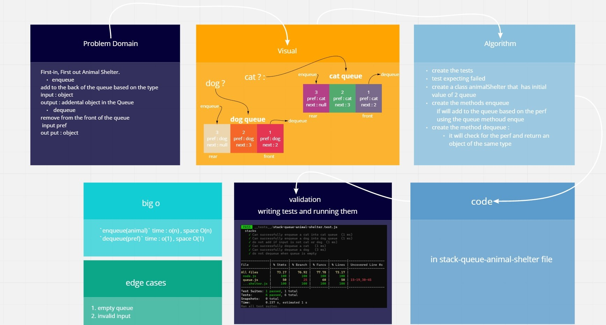

# Stacks And Queues

[**Pull Request**](https://github.com/hibasalem/data-structures-and-algorithms/pull/40)

Implementation of stacks and queues using linked lists

## Challenge

creating classes for each of the LinkedList and the node including methods for searching, inserting and turning it to string on the list then perform unit tests on each class

## Approach & Efficiency

- code chalange 12

  - stack-queue-animal-shelter

    `enqueue(value)` time : o(n) , space O(n)  
    `dequeue()` time : o(1) , space O(1)

---

---

- code chalange 12

  - **_AnimalShelter_**

  **enqueue(animal)** : add object into the AnimalShelter, using a lastin last out approach.

  **dequeue(pref)** : Removes the object from the front of the AnimalShelter
