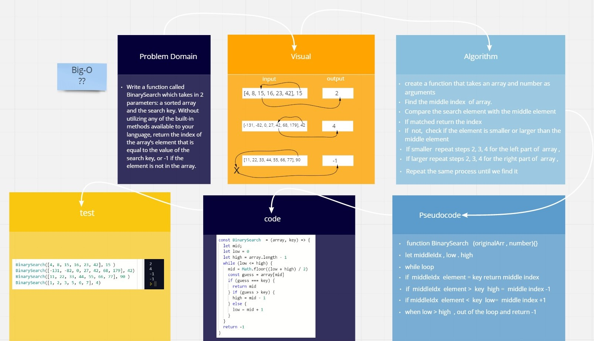

# Reverse an Array

Binary search in a sorted 1D array

- Write a function called BinarySearch which takes in 2 parameters: a sorted array and the search key. Without utilizing any of the built-in methods available to your language, return the index of the array’s element that is equal to the value of the search key, or -1 if the element is not in the array.

## Whiteboard Process

[white bored link](https://miro.com/welcomeonboard/Mk91aElTV3Z0aUdhVmRseGJ3UUxNWjdZbzdtN2d3OTBJc203NmlIQnptaTlxZEZGV1JOVXFUYXBPdWM2b3gxc3wzMDc0NDU3MzYwNzAzNjM4MTEz)

