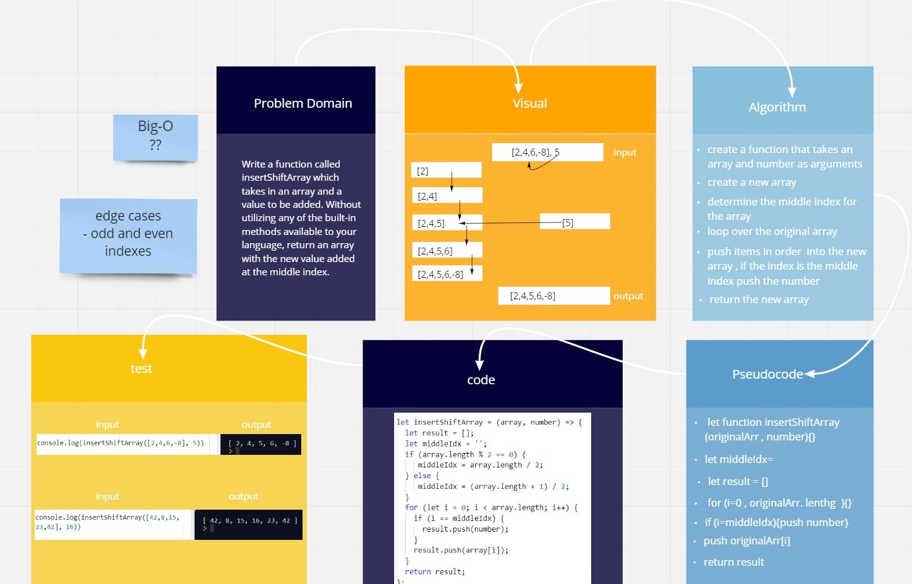

# Reverse an Array

Write a function called insertShiftArray which takes in an array and a value to be added. Without utilizing any of the built-in methods available to your language, return an array with the new value added at the middle index.

## Whiteboard Process

[white bored link](https://miro.com/welcomeonboard/OVZTRm1XRzB3V2FjQVVTT1l5SkhTNlEwd3B1NEZrNlFPUVRtS2RCQlpJVWV2Mm5ITlRsbGhGcVBZbThKUHVQMnwzMDc0NDU3MzYwNzAzNjM4MTEz)
