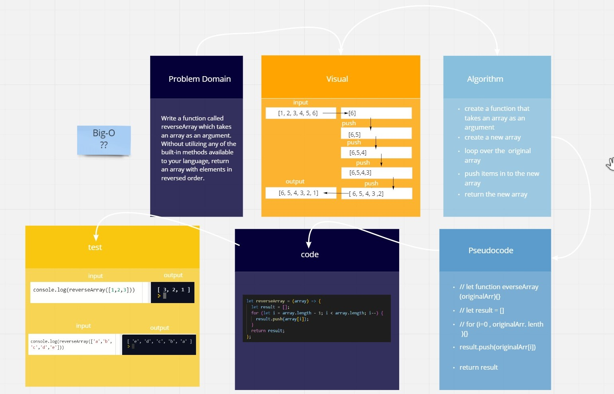

# Reverse an Array

Write a function called reverseArray which takes an array as an argument. Without utilizing any of the built-in methods available to your language, return an array with elements in reversed order.

## Whiteboard Process

[white bored link](https://miro.com/welcomeonboard/OVZTRm1XRzB3V2FjQVVTT1l5SkhTNlEwd3B1NEZrNlFPUVRtS2RCQlpJVWV2Mm5ITlRsbGhGcVBZbThKUHVQMnwzMDc0NDU3MzYwNzAzNjM4MTEz)
