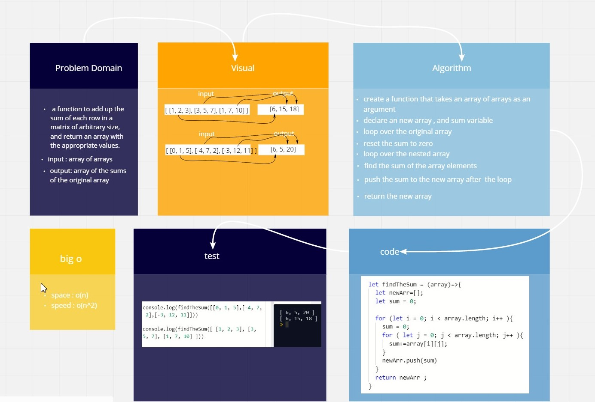

# Mock Interviews

- write a function to add up the sum of each row in a matrix of arbitrary size, and return an array with the appropriate values.

## Whiteboard Process

[the exl sheet](https://docs.google.com/spreadsheets/d/1jtX_56QnxVVqwz33-oibPm5MhMdJ2BRzageKLtrkUuw/edit#gid=0)

[white bored link](https://miro.com/welcomeonboard/R2R0T1Vub2ZhSHZielExcjB3WVl5NFNaRlM3OXloc1dSYTVsTU1nRmpjOFpyTDJyaGw5WVVDZkJna3NUTEs4TXwzMDc0NDU3MzYwNzAzNjM4MTEz)

